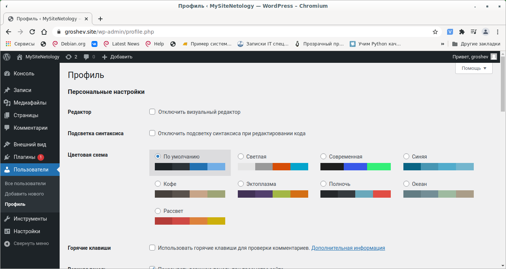
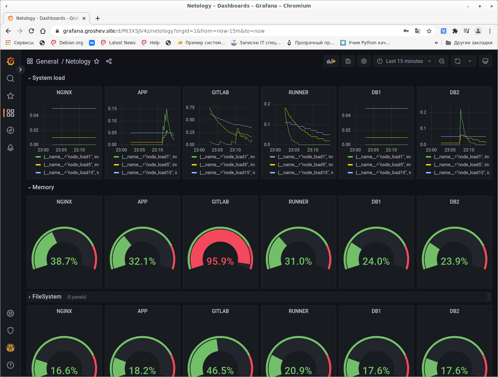
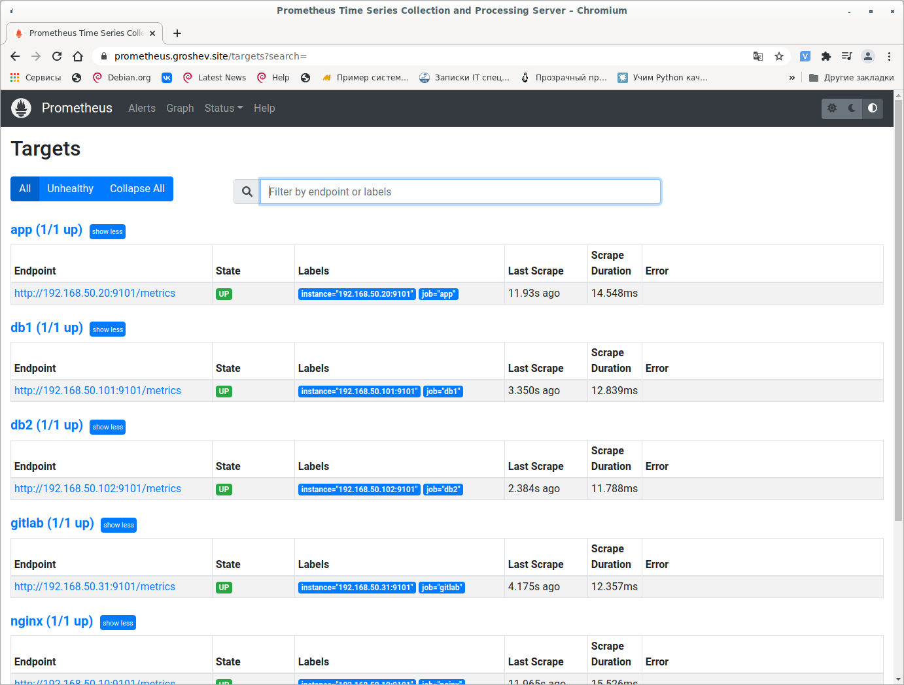
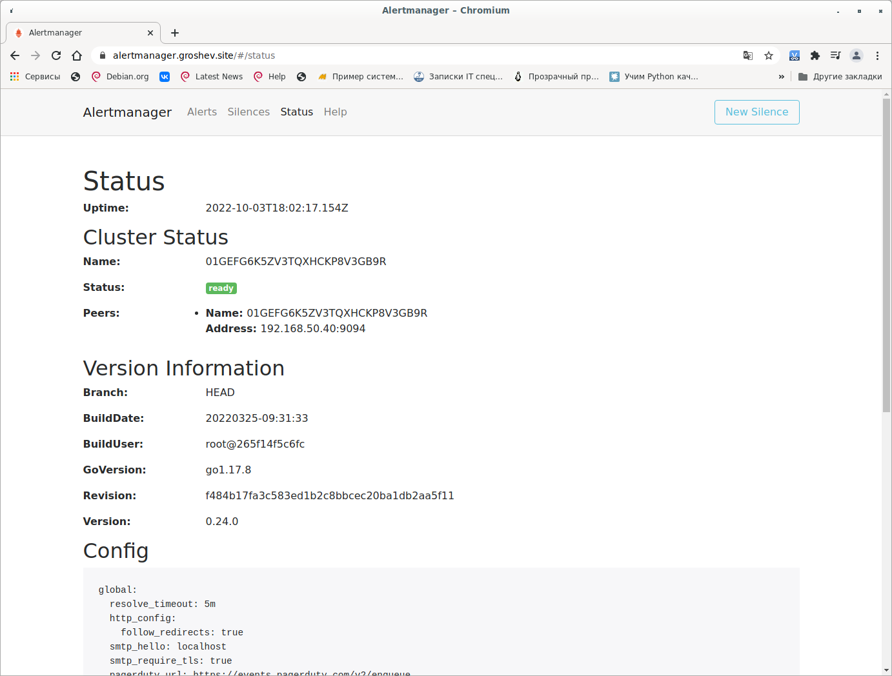
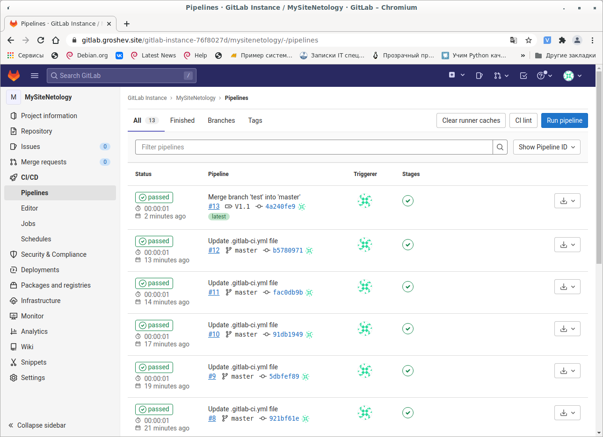
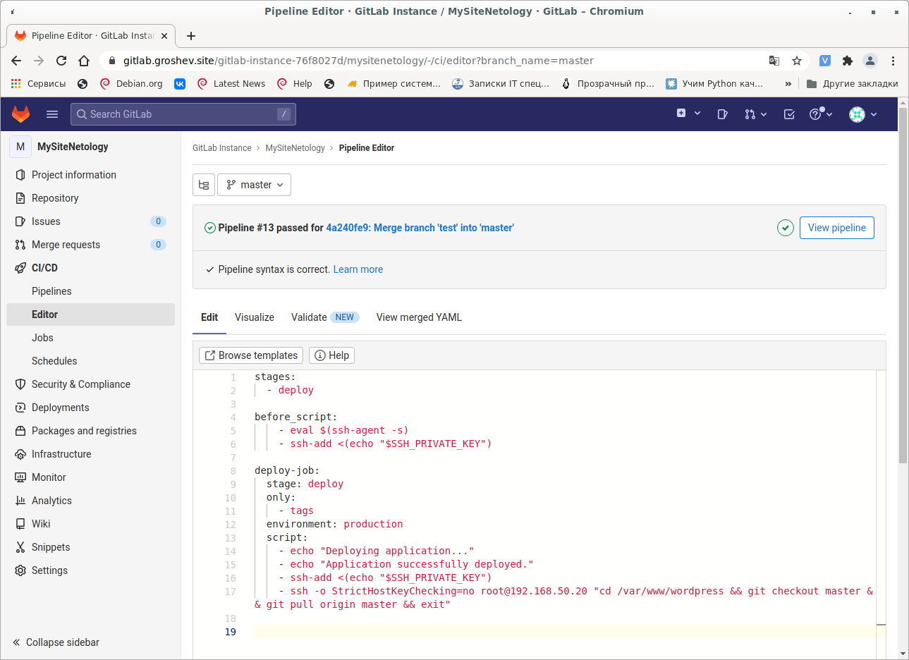
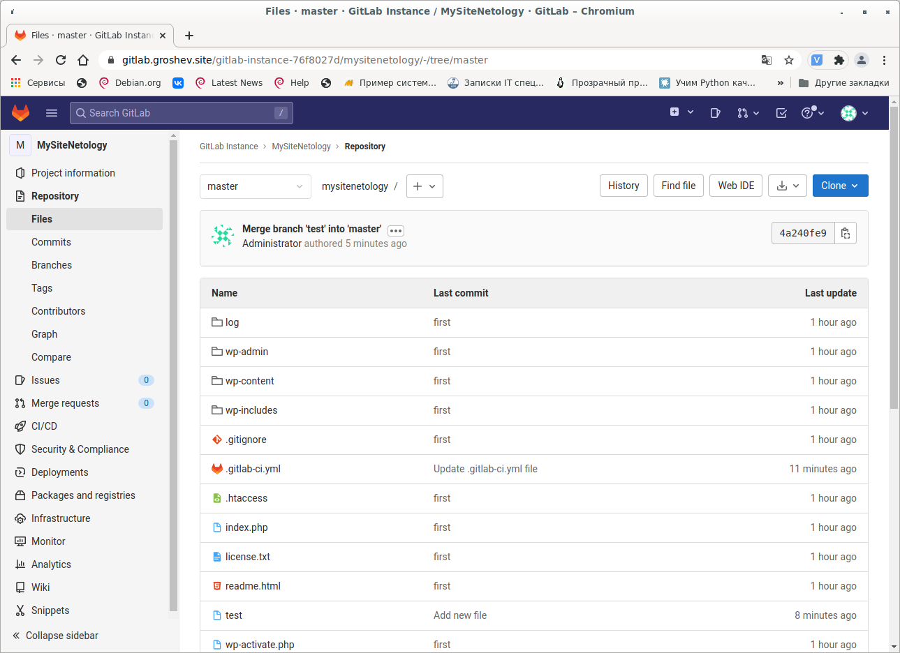

# Дипломная работа курса "DevOps-инженер"
За время выполнения проекта были выполнена следующие работы:
1. Разработка описания инфраструктуры на языке HCL для инструмента Terraform.
2. Зарегистрирован домен groshev.site
3. Разработаны роли Ansible для конфигурации инфраструктуры.

Этапы развёртывания инфраструктуры:
1. Клонировать репозитарий
```shell
git clone https://github.com/alexgro1982/diplom.git
```
2. Установить переменную среды для доступа к Yandex.cloud и развернуть инфраструктуру.
```shell
export YC_TOKEN=<ключ>
terraform apply
```
При успешном развёртывании инфраструктуры, в консоль выведется публичный ip адресс. Его нужно внести в настройки DNS.

3. Для регистрации gitlab runner нужно выполнить следующее:
```shell
ansible-playbook -i ../ansible/inventory ../ansible/main.yml --tags RegisterRunner
```
Во время выполнения плейбука, система запросит Registration token, который можно взять из WEB интерфейса https://gitlab.groshev.site

4. Можно приступать к конфигурированию Gitlab через WEB интерфейс.

## Скриншоты сервисов
1. https://groshev.site


2. https://grafana.groshev.site


3. https://prometheus.groshev.site


4. https://alertmanager.groshev.site


5. https://gitlab.groshev.site



